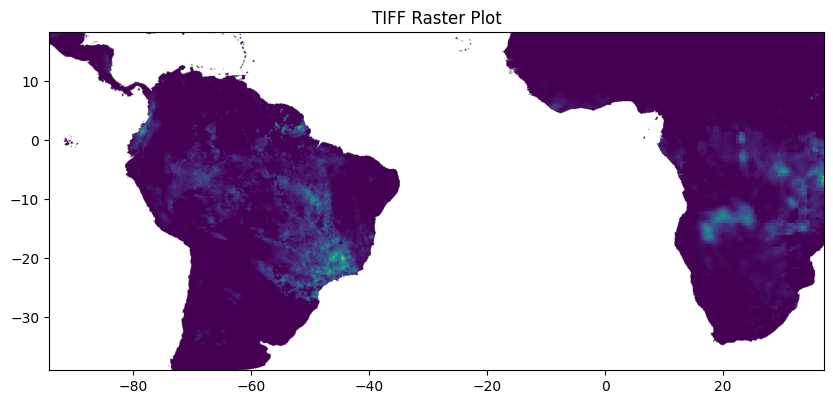

# Download Scripts/ Processes for databases

- All rasters are resampled to 0.02 degrees using bilinear if decimal and nearest neighbour if integer.
- All rasters in 4326 CRS after resampling
- All raster nodata is -9999.0 exept terraclim (-32768)
- All global rasters are clipped to Bbox (GEE): ee.Geometry.BBox(-94.187, -39.020, 37.062, 18.229)
- Terraclim netcdf to raster conversion with resampling using scripts for each variable in netcdf2raster folder. (Replace your own paths to gdal_translate.exe, gdal_warp.exe)
- NASA Power netcdf to raster using python script convert_netcdf_raster.py 

| Dataset        | Variables                | Unit    | Cadence       | Native Resolution | Data Type/ Format   | Native CRS      | Date Range Available | Scale Factor
|----------------|--------------------------|---------|---------------|-------------------|-------------|-----------------|----------------------|----------------------|
| Worldclim      | tmax, tmin, prec    (averaged monthly)        | celcius | Monthly       | 0.04 degrees      | float32/ tiff | EPSG:WGS84 4326 | 1960-2021   | 10         |
| Evapotranspiration | et                   | Mm      | 8 days once   | 0.02 degrees      | float32/ tiff| EPSG:WGS 84 6842| 2000-2024            | 0.1
| CHIRPS         | prec                     | Mm      | Daily         | 0.1 degrees       | float32/ tiff| EPSG:WGS84 4326 | 1990-2020            | NA
| SPEI           | index                    | -       | Monthly       | 0.5 degrees       | float32/ tiff| EPSG:WGS84 4326 | 1990-2024            | NA
| Soil Grids*         |      bdod, cec, cfvo, clay, nitrogen, ocd, ocd, phh2o, sand, silt, soc, wv0010, wv0033, wv1500   |  cg/cm³, mmol(c)/kg, cm3/dm3 (vol‰), g/kg, cg/kg, pHx10,g/kg, g/kg,dg/kg, hg/m3,t/ha      | Aggregated mean over years | 1000 meters       | int16/ tiff| ESRI:54052  | 1905-2016  | 100, 10, 10, 10, 100,  10, 10, 10,  10, 10, 10
| Terraclim   | aet, def, PDSI, pet, ppt, q, soil, srad, tmax, tmin, vap, vpd, ws  |  mm, mm, mm, mm, mm, mm, W/m2, mm, C, C, kPa, m/s, kPa, unitless | Monthly |   1/24th degree     | float32/ netcdf| WGS84,EPSG:4326 | 1982-2024        |
|  NASA Power  |     airmass, allsky_kt, allsky_nkt, allsky_sfc_lw_dwn, allsky_sfc_lw_up, allsky_sfc_par_diff, allsky_sfc_par_dirh, allsky_sfc_par_tot, allsky_sfc_sw_diff, allsky_sfc_sw_dirh, allsky_sfc_sw_dni, allsky_sfc_sw_dwn, allsky_sfc_sw_up, allsky_sfc_uv_index, allsky_sfc_uva, allsky_sfc_uvb, allsky_srf_alb, aod_55, aod_55_adj, aod_84, cloud_amt, cloud_amt_day, cloud_amt_night, cloud_od, clrsky_days, clrsky_kt, clrsky_nkt, clrsky_sfc_lw_dwn, clrsky_sfc_lw_up, clrsky_sfc_par_diff, clrsky_sfc_par_dirh, clrsky_sfc_par_tot, clrsky_sfc_sw_diff, clrsky_sfc_sw_dirh, clrsky_sfc_sw_dni, clrsky_sfc_sw_dwn, clrsky_sfc_sw_up, clrsky_srf_alb, midday_insol, original_allsky_sfc_sw_diff, original_allsky_sfc_sw_dirh, psh, pw, srf_alb_adj, toa_sw_dni, toa_sw_dwn, ts_adj |  dimensionless, dimensionless, dimensionless, W m-2, W m-2, W m-2, W m-2, W m-2, W m-2, W m-2, W m-2, W m-2, W m-2, W m-2, W m-2, W m-2 x 40, dimensionless, dimensionless, dimensionless, dimensionless, %, %, %, dimensionless, Days, dimensionless, dimensionless, W m-2, W m-2, W m-2, W m-2, W m-2, W m-2, W m-2, W m-2, W m-2, W m-2, dimensionless, W m-2, W m-2, cm, dimensionless, W m-2, W m-2, C  | Monthly | 1 degree  | float32/netcdf | WGS84,EPSG:4326  | varies for each variable  |
| Elevation (Worldclim)     | elevation        |  | static       | 0.0083 degrees      | int16/ tiff | EPSG:WGS84 4326 | NA            |

**Soil Grids and SRTM was manually resampled using QGIS and the crs was changed using QGIS for Soil Grids***

Links to dbs:
[Worldclim](https://www.worldclim.org/data/worldclim21.html)
[SoilGrids](https://www.isric.org/explore/soilgrids/faq-soilgrids#When_100_metres_resolution)
[NASA Power](https://power.larc.nasa.gov/docs/tutorials/service-data-request/aws/)
[Terraclim](https://www.climatologylab.org/terraclimate-variables.html)
[Chirps](https://www.worldclim.org/data/worldclim21.html)
[Evapotranspiration](https://www.worldclim.org/data/worldclim21.html)
[SPEI](https://www.worldclim.org/data/worldclim21.html)

## CheckList
- [ ] Automate soilgrids resampling 
- [ ] Resample ERA5 with space considerations
- [ ] Add Links to chirps, spei and et
- [ ] Add remaining scale factors
- [ ] Fix Terraclim Nans to -9999.0
