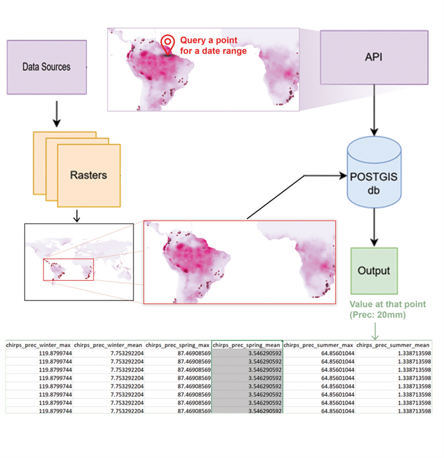

# Geospatial-Database-Camcore Collaboration Guide

## Project Overview

The Geospatial Database project processes geographical data through several stages:

1. **Data Collection** -The data is collected from websites hosting the data/ Google Earth Engine 

2. **Raster Processing** - Rasters are resampled to 0.02 seconds resolution and nodata field set to -9999.0 

3. **Database Storage** - Rasters are uploaded to POSTGIS Database using plsql tool to a single database on a Camcore System.


4. **API Access** -The rasters are queried based on date range and location based on a point geometry via API; point queries for specific date ranges

5. **Output Generation** - Precise values at specific points are returned for various data sources as a csv if needed. Covariables can also be generated. 



## Data Download and Access

**coming soon!**


## Basic Collaboration Workflow

3. **Create a branch for your work**
   ```bash
   git checkout -b Feature-Name
   ```

4. **Make changes and commit**
   ```bash
   git add .
   git commit -m "Added feature"
   ```

5. **Push your branch to GitHub**
   ```bash
   git push origin Feature-Name
   ```

6. **Create a Pull Request**
   - Go to repository on GitHub
   - Click "Pull requests" → "New pull request"
   - Select your branch to compare with master
   - Add title and description
   - Create pull request

7. **Review and merge**
   - Review others' code 
   - Once approved, merge PR into master branch

## Staying Updated

8. **Update local master branch**
   ```bash
   git checkout master
   git pull origin master
   ```

9. **Update feature branch with changes from master**
   ```bash
   git checkout Feature-Name
   git merge master
   ```

## Handling Conflicts

10. **Resolve merge conflicts**
    - Look for conflict markers (`<<<<<<`, `======`, `>>>>>>`)
    - Edit files to resolve conflicts
    - Mark as resolved: `git add file-name`
    - Complete the merge: `git commit`

## Collaboration Guidelines

11. **Repository Rules**
   - **Do NOT make Pull Requests (PRs) into main.**
   - All changes must be made through *feature branches* or *approved dev branches*.
   - If you're contributing to an *existing feature*, use that branch.
   - If you're adding a *new feature*, create a new branch and PR into it.

12. **Project-specific practices**
   - **Branch naming convention:** Capitalize first letter of each word and join words with hyphens (e.g., `Data-Download-Scripts`)
   - **Code review process:** Check raised pull request and merge with branch if it looks okay!
   - **PR merging responsibilities:** Merge ASAP. Check repo daily please!
   - **Commit message format:** "Added xyz feature"
   - **Checklist:** Update checklist as and when done. Feel free to add new features!


## CheckList

- [x] Data download scripts
- [x] Data resampling
- [x] Data upload to PostGIS
- [ ] API v1 implementation
- [ ] API v2 with enhanced features
- [ ] CSV creator
- [ ] Covariables creator
- [ ] Package for Covariables creator
- [ ] Airflow pipeline for automation of new data download
- [ ] Implement other region downloads and pipeline for db creation
- [ ] Add visualization components
- [ ] Documentation
- [ ] Testing framework